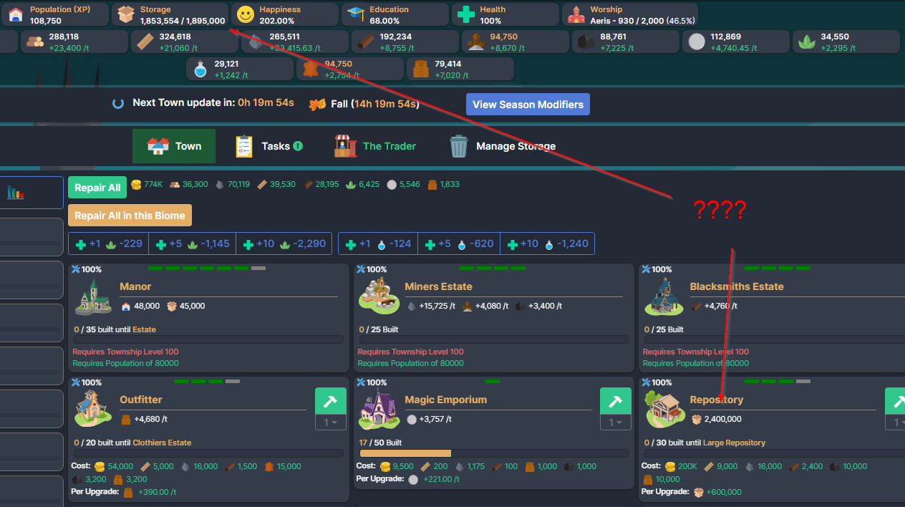
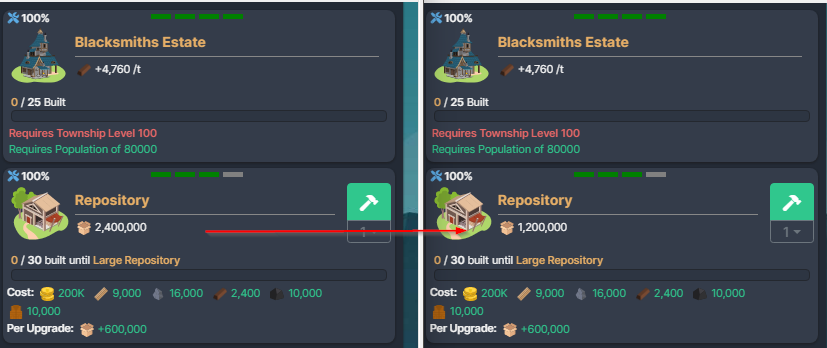
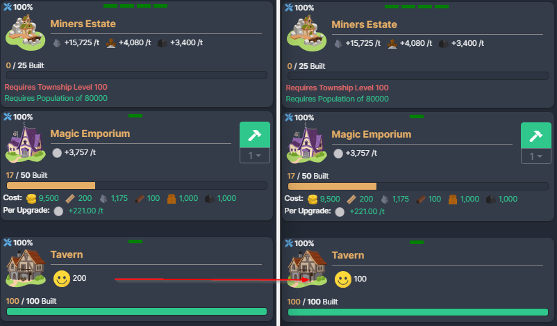
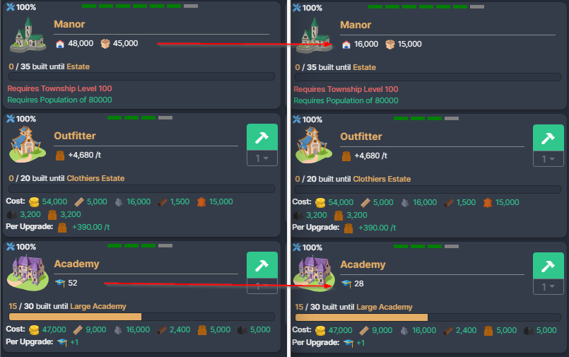

# [Myth] Township

This mod contains the following features:

## Fix Totals Count Bug

The totals displayed on individual buildings that generate population, happiness, education, storage and worship are incorrect. This fixes the bug by replacing the `BuildingInTownElement.updateBuildingTotals` function and correctly implementing the building count.

This is purely a visual bug on the individual buildings and no underlying game logic is modified. The totals displayed at the top of the Township page is correct, but if you add up the individual tiles across your town, they don't match the total at the top.

### Bug Description

The bug is that the total calculation for a building includes buildings across all biomes instead of just itself.

For example:

* 100 Taverns in Grassland = 50 Happiness
* 100 Taverns in Snowlands = 100 Happiness

However, this isn't what is shown on the individual tiles.

* Grassland = 100 Happiness
* Snowlands = 200 Happiness

As you can see the total calculates buildings from both biomes, and not just the individual biome for the calculation.

With this fix, you can actually add up what is displayed on each tile and it matches what is actually generated by the township.
